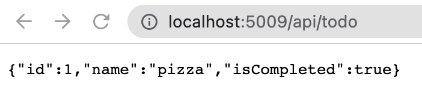

# API Generation 🤖

This project uses [roslyn](https://github.com/dotnet/roslyn) to create an API from open api specification.
View a post on the idea behind this project [here](https://www.maisiesadler.co.uk/api-generation/blog).

This ensures that the application is always returning models that match the defined API specification.

The easiest way to describe what the project does is through an example of what is generated:

For the following yaml

```yaml
openapi: 3.0.1
paths:
  /api/Todo:
    get:
      tags:
        - Todo
      operationId: ApiTodoGet
      responses:
        '200':
          description: Success
          content:
            application/json:
              schema:
                type: array
                items:
                  $ref: '#/components/schemas/ToDoItem'
components:
  schemas:
    ToDoItem:
      type: object
      properties:
        id:
          type: integer
          format: int32
        name:
          type: string
          nullable: true
        isCompleted:
          type: boolean
```

A controller, model and interface are generated.

Controller:

```csharp
[ApiController]
[Route("/api/Todo")]
public class ApiTodo : ControllerBase
{
    private readonly IGetApiTodoInteractor _getApiTodoInteractor;
    public ApiTodo(IGetApiTodoInteractor getApiTodoInteractor)
    {
        _getApiTodoInteractor = getApiTodoInteractor;
    }

    [HttpGet]
    public async Task<IActionResult> Get()
    {
        var result = await _getApiTodoInteractor.Execute();
        return Ok(result);
    }
}
```

Model:

```csharp
public record ToDoItem
{
    [JsonPropertyName("id")]
    public int? Id { get; init; }

    [JsonPropertyName("name")]
    public string? Name { get; init; }

    [JsonPropertyName("isCompleted")]
    public bool? IsCompleted { get; init; }
}
```

Interface:

```csharp
public interface IGetApiTodoInteractor
{
    Task<ToDoItem[]> Execute();
}
```

This can either be implemented or use the AutoFixture implementation, to create a generated response:

```csharp
public class GetApiTodoInteractor : IGetApiTodoInteractor
{
    private readonly Fixture _fixture = new Fixture();
    public async Task<ToDoItem[]> Execute()
    {
        return _fixture.Create<ToDoItem[]>();
    }
}
```

---

Generated files for [definition.yaml](./definition.yaml) can be found [here](./example/generated/README.md)

This can then be implemented in the project with any custom logic, [e.g.](example/implementations/GetApiTodoInteractor.cs).

The above examples are from the [example project](./example) generated by the [definition](./definition.yaml) file in the root of the project. 
All of the generated files are in the [generated](./example/generated) folder in that project, this folder is deleted and recreated on each run.

Running `dotnet run --project example` and navigating to `http://localhost:5009/api/todo` produces the following response:



## Usage

There are two available projects [OpenApiSpecGeneration.ApiGeneration](./src/OpenApiSpecGeneration.ApiGeneration) and [OpenApiSpecGeneration.ApiGeneration.Console](./src/OpenApiSpecGeneration.ApiGeneration.Console).

The first can be used as a package (soon) and the second is a console app that takes an input file and produces c# files to the gievn output directory. See the project folder for more details on usage.

## Contributing

## What's supported

Uses [Microsoft.OpenApi](https://github.com/microsoft/OpenAPI.NET) models and reader and so JSON and YAML open api specs are supported through that library.

### Reading open api specs

The [console app](src/OpenApiSpecGeneration.ApiGeneration.Console) takes an input json openapi spec and outputs C# files to the given output directory.
