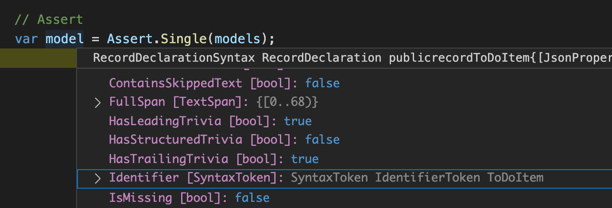

# Api Definition Generation

After watching [this](https://www.youtube.com/watch?v=j6ow-UemzBc) video about microservices done right and hearing about how they use custom config files to generate APIs, clients, mocks, and tests. I started to think about how powerful that could be, and how we could make it useful at work.

At TrueLayer we maintain OpenAPI specifications for all of our services and then the application is designed against the OpenAPI spec. It would be great if we had some assertion that the code we create is exactly as in the spec.

Could we generate a C# API from an OpenAPI specification?

## The Idea

I wanted to take an OpenAPI specification and generate models and controllers that match that spec.

Ideally, the generated files could be deleted and regenerated so they would need to compile without extra code.
The generated code shouldn't depend on the tool, in case it isn't maintained or the API simply wants to diverge from it.

The idea I had was that each route could have an interface that matched it, the controller would then resolve the interface and return the model.

Controller method:

```csharp
[HttpGet]
public async Task<ThingModel> Get()
{
    return await _getThingInteractor.Execute();
}
```

Interactor interface:

```csharp
public interface IGetThingInteractor
{
    Task<ThingModel> Execute(); 
}
```

This interface could then be implemented in the service.

The other requirement was that the tool needed to be easier to use than writing the API yourself so that people choose to use it.

### Benefits

- 🤩 Running API code is consistent with spec
- 🤩 Consistent code across all APIs generated with this tool
- 🤩 Apply best practices in one place

## The implementation

### Generating Code

The way to generate C# code is using [Roslyn](https://github.com/dotnet/roslyn), the open-source implementation of the .NET Compiler.

I found [this](https://www.stevejgordon.co.uk/getting-started-with-the-roslyn-apis-writing-code-with-code) article (written by the author of [this](https://www.stevejgordon.co.uk/introduction-to-httpclientfactory-aspnetcore) wonderful series of posts on HttpClientFactory - well worth a read!) that had some reference code that I could get started with.

The code looks weird when you first start working with it, but the API is pretty consistent so you start to get a feel for what the functions are expecting.

Once I had some code to read a file, generate a class and save it as a C# file I started to look at how I could write tests against it.
I'm a big advocate for TDD and the confidence it gives you while you're developing.
The code to generate the file looks like this:

```csharp
var node = GenerateModel(); // node contains usings, namespace and class to create one file
await using var streamWriter = new StreamWriter(fileLocation);
node.NormalizeWhitespace().WriteTo(streamWriter);
```

I'd like my tests to test as much as possible and be easy to work with, I didn't want to read files or mess around with TextWriter and so decided that my test suite would work with the public interface of `GenerateModel` and assert against the roslyn types.

### Generating useful code

Now I can generate some code I wanted to be able to generate the controllers, interactors, and models to create an API.

#### First the models

The TDD approach is to write a test to describe the thing you're implementing and then only add the code required for that feature. In this case, I wasn't sure what the roslyn types should look like so there was a bit of back and forth between trying stuff/debugging the types and being able to write the asserts.

The first bit of behaviour I wanted to create was a type with the right name, the test looked something like this:

```csharp
// Arrange
var toDoItemProperties = new Dictionary<string, OpenApiComponentProperty>
{
    { "id", new OpenApiComponentProperty("integer", default, default) },
};
var componentSchemas = new Dictionary<string, OpenApiComponentSchema>
{
    { "ToDoItem", new OpenApiComponentSchema("object", toDoItemProperties) }
};
var components = new OpenApiComponent(componentSchemas);
var spec = new OpenApiSpec(new Dictionary<string, OpenApiPath>(), components);

// Act
var models = ApiGenerator.GenerateModels(spec);

// Assert
var model = Assert.Single(models);
```

I didn't know how to get the name yet so a quick debug,



Then filling out the asserts...

```csharp
// Assert
var model = Assert.Single(models);
Assert.Equal("ToDoItem", model.Identifier.Value);
var classModifier = Assert.Single(recordDeclarationSyntax.Modifiers);
Assert.Equal("public", classModifier.Value);
```

I worked iteratively like this while implementing different bits of the model, adding attributes for `JsonPropertyName`, adding the namespace, etc until I got a feel for what the roslyn models look like.

I also set up an example project so I would know when the types I was creating generated something that compiles and could be worked with. This was created using `dotnet new webapi` and removing the default controller. The generated code is all under `./generated` and is deleted and recreated each time the tool runs. View the example project [here](https://github.com/maisiesadler/api-generation/tree/main/example).

## The Result

The idea works! I can generate a usable API from an OpenAPI spec - this is really cool!

## Configurable or Opinionated

One of the aims of this would be that it keeps code consistent across projects and so that means the generated code is opinionated and I was making a lot of decisions about what the code looks like along the way.

In the balance between configurable and opinionated, this leans towards opinionated.

Wonder if the OpenAPI spec gives us enough info, or if there would need to be another layer above the OpenAPI spec to generate both?

## Pros and Cons

Two big benefits to this approach
- Reducing boilerplate code
- Assertion that code matches the spec

One of the cool things about this solution are that, since it only creates a part of the project, the project is still free to implement other functionality as they see fit.

On the other hand this solution is more code to maintain and adds a layer of complexity.
Steeper learning curve for newcomers. Need to work out a process to either enforce this way of working.

Worry about the maintainability of the project.


It's definitely more complicated than writing the API manually and so we need to be cautious the benefits of using it outweigh the extra complexity.
The generated API can be separated without the tool and I would always argue for automation over manual steps.

### Other options

One of the trickiest bits would be to get all the functionality some might require into the controller - or allow them to specify all the options using the OpenAPI specification.

Another idea would be to just generate the models - getting a large portion of the benefits and still allowing the developers to configure the controllers as they see fit.

Another idea would be to write a code analysis tool that verifies the generated code matches the spec.

### To make this thing work

I tried it against another OpenAPI spec and found that the OpenAPI definition types I have created are probably not very well defined against the spec.
I think if this would work then enforcing some code styles around definitions that could/should be used would be required.

Need to decide if it's worth investing more time into this project or a similar new project based on this idea.

How can we make this actually useful, and easier to use than making the change yourself?
Where would it run?
Could it be enforced somehow? Using CI, could we get it to work before CI?

The question still stands - is this easier than just writing the code ourselves?
